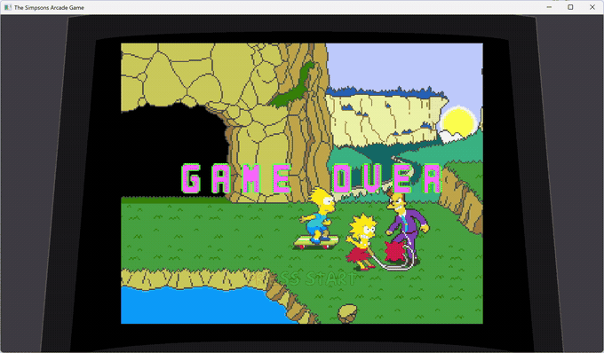
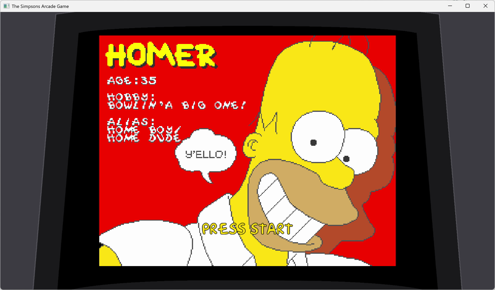
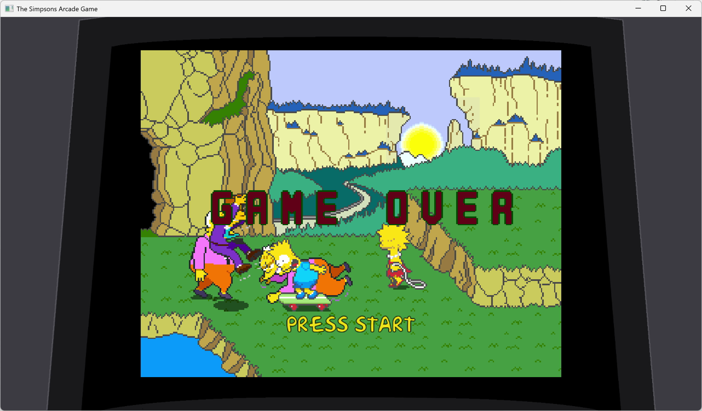

# 🍩 simpsonsarcade-ps3 — Static Recompilation

> *"Mmm... native code."* — Homer J. Simpson, probably

A static recompilation of **The Simpsons Arcade Game** (PlayStation 3 / PSN) into a native
PC executable — no emulator required — built on [ps3recomp](https://github.com/sp00nznet/ps3recomp).

This is the PS3 sibling of our **already-playable** Xbox 360 port,
[`simpsonsarcade`](https://github.com/sp00nznet/simpsonsarcade). Same game, same Konami arcade
core, same data files — just a different flavour of PowerPC underneath. The plan was to steal
everything we learned over there and point it at the Cell — and it worked: this build boots,
plays its intro, reaches the menus, and runs the arcade core natively.

> **Why this is easier than it sounds:** both the Xbox 360 (Xenon) and the PS3 (Cell PPE) run
> **64-bit big-endian PowerPC with VMX/AltiVec**. We already recompiled this exact game once.
> The PS3 EBOOT is *the same game logic* compiled by a different toolchain for a sister CPU.

---

## 🎥 It Runs



*Attract mode, captured from the native build — no emulator.*

| | |
|---|---|
|  |  |

## 📺 The Game

| | |
|---|---|
| **Title** | The Simpsons Arcade Game |
| **Platform** | PlayStation 3 (PSN download) |
| **Title ID** | `NPUB30563` |
| **Content ID** | `UP0101-NPUB30563_00-SIMPSONSARCADEKO` |
| **Trophy ID** | `NPWR01444_00` |
| **Developer** | Backbone Entertainment / Konami |
| **Publisher** | Konami |
| **Original** | 1991 Konami 4-player arcade beat-'em-up |
| **Players** | Homer, Marge, Bart & Lisa (1–4 player co-op) |

Under the hood, the PSN/XBLA release is an **arcade-emulator wrapper**: the original 1991 coin-op
ROM lives inside the `SIMPSONS.SR` data archive (we can see the romset manifest —
`Simpsons_4J.KON`, `..._TILES/SPRITES/SOUND/SAMPLES.ROM`), and the EBOOT emulates the arcade
hardware around it — Konami 052001 (6809) + Z80 + `YM2151` + K053260, all named right in the
binary. Same architectural trick as the Genesis-on-XBLA ports like Comix Zone. **We recompile the
emulator; the game's 6809 code just gets interpreted from the ROM** — which is why the
already-working 360 build is such a strong oracle. See [`docs/emulator-architecture.md`](docs/emulator-architecture.md).

---

## 🎯 Status

**Playable.** The title boots, plays its intro, reaches the menus, and runs the
arcade core at 28–49 fps with keyboard input.

| Milestone | Status |
|---|---|
| Locate & extract the PSN PKG | ✅ Done |
| Confirm it's the same game as the 360 build | ✅ Done — `SIMPSONS.SR` is **byte-identical** (2,748,416 B) |
| Decrypt EBOOT.BIN (SELF → ELF) | ✅ Done — `rpcs3 --decrypt` (no RAP needed) |
| Function discovery + PPU lift | ✅ Done — 3,813 detected → **5,019 lifted** |
| Build on the shared ps3recomp harness | ✅ Done — same shape as flOw / Twisted Metal |
| First boot (recompiled CRT runs) | ✅ Done |
| Reach `main()` / CRT init | ✅ Done |
| SPURS/CRI SPU jobs execute | ✅ Done — the two job binaries are lifted and registered |
| Graphics (RSX → D3D12) | ✅ Done — caner's live NV4097 engine, `RSX_LIVE_DRAW=1` |
| Intro videos → menus → attract | ✅ Done |
| Arcade core running | ✅ Done — Stage 1 Downtown Springfield plays |
| Input | ✅ Keyboard; XInput pad when one is attached |
| 🍩 Playable | ✅ **Yes** |
| Audio | ⚠️ Plays, stutters |
| UI artifacts | ⚠️ Font atlas occasionally drawn as a full-screen quad |
| Frame rate | ⚠️ 28–49 fps (target 60) |

### Known issues

- **Audio stutters.** Not yet investigated.
- **UI artifact.** Entering some menus can draw the whole font/button atlas as one
  screen-filling quad. Intermittent; the vertex-attribute analysis was measured
  correct when it happened, so the cause is still open. `YZ_RSX_VERTEX_MODE=L` is
  a usable workaround, not a diagnosis.
- **Frame rate.** 28–49 fps rather than 60. No longer single-thread bound.

See [`PROGRESS.md`](PROGRESS.md) for the blow-by-blow.

---

## 🧬 How It Lines Up With the 360 Build

The whole reason this project exists: **we already did the hard part once.** Here's the overlap.

| | Xbox 360 (done, playable) | PlayStation 3 (this repo) |
|---|---|---|
| CPU | Xenon — 64-bit big-endian PowerPC + VMX128 | Cell PPE — 64-bit big-endian PowerPC + VMX/AltiVec |
| Executable | `default.xex` (XEX2, 1.33 MB) | `EBOOT.BIN` (SELF, 1.63 MB) |
| Code base | `.text` @ `0x820A0000`, size `0x237350` | `.text` @ `0x10000`, size `0x1628E8` |
| Entry point | `0x8214DB50` | `0x00186900` |
| Recompiler | XenonRecomp → C++ | ps3recomp `ppu_lifter` → C++ |
| Runtime | ReXGlue SDK (Xbox 360 HLE) | ps3recomp HLE libs (LV2/Cell HLE) |
| **Game data** | `0B/SIMPSONS.SR` (2,748,416 B) | `0B/SIMPSONS.SR` (**2,748,416 B — identical**) |
| **Assets** | `0B/SIMPSONS_FW.SR` (14.4 MB) | `0B/SIMPSONS_FW.SR` (15.8 MB) |

**What transfers directly:** the function-level structure of the arcade emulator core, the `.SR`
archive format and load path, the VMX/AltiVec usage patterns, the speed-fix lessons (timebase
scaling, frame limiting), and the menu/unlock logic we reverse-engineered on the 360.

**What's different:** the OS layer (Xbox kernel/XAM/XMA vs. LV2/Cell/cellGcm/cellAudio), the GPU
(Xenos vs. RSX), the executable container, and address layout. Those are exactly the gaps
ps3recomp already fills (see the `flOw` and `tokyojungle` ports).

Full analysis: [`docs/360-crossref.md`](docs/360-crossref.md) · PS3 binary notes:
[`docs/binary-analysis.md`](docs/binary-analysis.md).

---

## 🛠️ Pipeline

```
  PSN PKG ──► EBOOT.BIN ──► EBOOT.elf ──► ppu_lifter ──► C++ ──► link ps3recomp ──► simpsons.exe
              (SELF)        (decrypt)     (5,019 fns)           (shared harness + HLE)
                                              ▲
             SPURS job images ── spu_lifter ──┘   (captured at dispatch, not in the EBOOT)
```

Same five-stage flow as every ps3recomp port — extract, decrypt, analyse, lift, link. The
[`flOw`](https://github.com/sp00nznet/flow) port is the reference implementation of this pipeline.

## 📦 Building

Prereqs: Python 3.9+, CMake 3.20+, **clang-cl** + Ninja (the shared harness uses
`__builtin_bswap` and weak symbols MSVC lacks), and a sibling
[ps3recomp](https://github.com/sp00nznet/ps3recomp) checkout.

```bash
# 1. Decrypt your own legally-dumped EBOOT.BIN -> game/EBOOT.elf, and lay the
#    game data out the way the harness expects:
#       vfs/PS3_GAME/PARAM.SFO
#       vfs/PS3_GAME/USRDIR/EBOOT.elf
#       vfs/PS3_GAME/USRDIR/0B/SIMPSONS.SR, SIMPSONS_FW.SR

# 2. Lift the PPU image and generate the HLE NID table:
PS3RECOMP=../ps3recomp ./tools/relift.sh

# 3. Capture and lift the SPU job binaries. They are raw images the game builds
#    in main memory, not ELFs in the EBOOT, so they only exist at the moment
#    cellSpurs hands them over:
SPU_DUMP_MISS=spu_dump ./build/simpsons vfs/PS3_GAME/USRDIR/EBOOT.elf
PS3RECOMP=../ps3recomp ./tools/relift.sh     # now lifts them too

# 4. Build. Release is the default and it matters -- an unoptimised build of the
#    25 MB recompiled translation unit runs at a third the speed.
cmake -S . -B build -G Ninja -DCMAKE_C_COMPILER=clang-cl -DCMAKE_CXX_COMPILER=clang-cl
cmake --build build

# 5. Run, with the live NV4097 -> D3D12 draw engine:
RSX_LIVE_DRAW=1 ./build/simpsons vfs/PS3_GAME/USRDIR/EBOOT.elf
```

**Controls (keyboard).** Arrows move · `Z` attack · `X` jump · `A`/`S`
square/triangle · `Q`/`W` L1/R1 · `Enter` START · `Tab` SELECT. An XInput pad
takes over automatically when one is plugged in.

## ⚖️ Legal

This repository contains **no copyrighted game code, assets, binaries, or encryption keys** —
only analysis notes, configuration, and recompilation tooling. You must supply your own legally
obtained copy of The Simpsons Arcade Game. `pkg/`, `extracted/`, and `game/` are git-ignored.

## 🔗 Related Projects

- [ps3recomp](https://github.com/sp00nznet/ps3recomp) — the PS3 HLE runtime this links against
- [simpsonsarcade](https://github.com/sp00nznet/simpsonsarcade) — **the 360 port of this same game (playable)**
- [flOw](https://github.com/sp00nznet/flow) · [tokyojungle](https://github.com/sp00nznet/tokyojungle) — sister PS3 ports
- [N64Recomp](https://github.com/N64Recomp/N64Recomp) · [UnleashedRecomp](https://github.com/hedge-dev/UnleashedRecomp) — prior art
- [RPCS3](https://github.com/RPCS3/rpcs3) — emulator whose HLE research makes this possible

---

*"I'm not normally a praying man, but if you're up there, please save me, Superman."* — port it natively instead.
