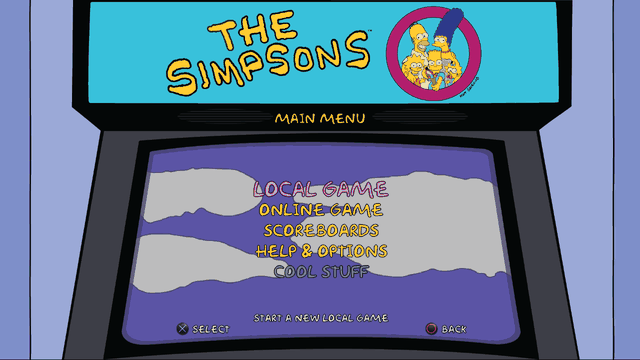
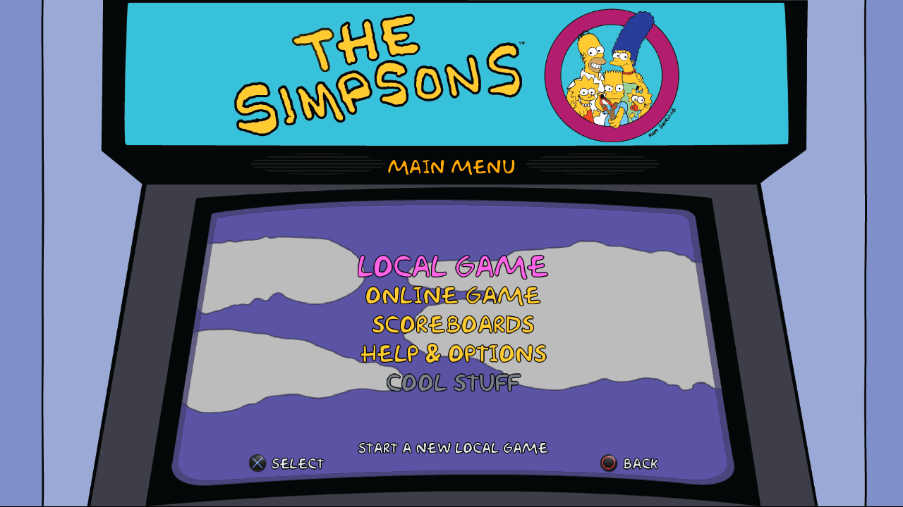
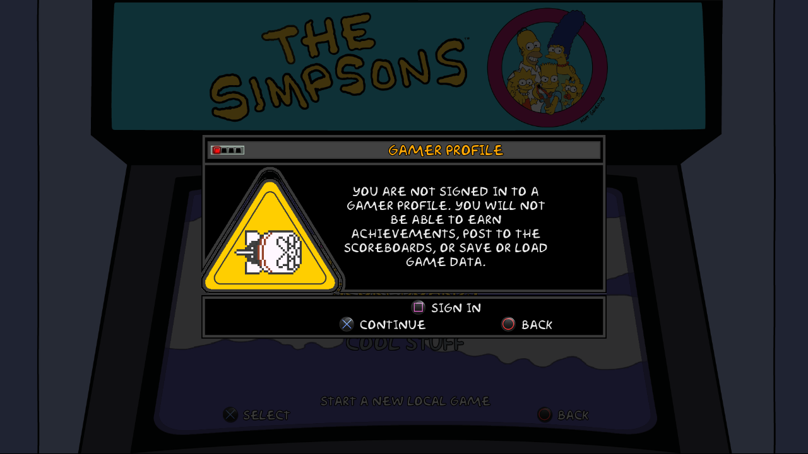
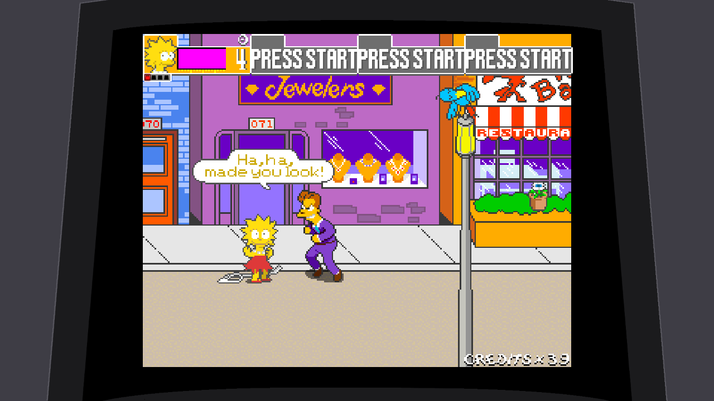
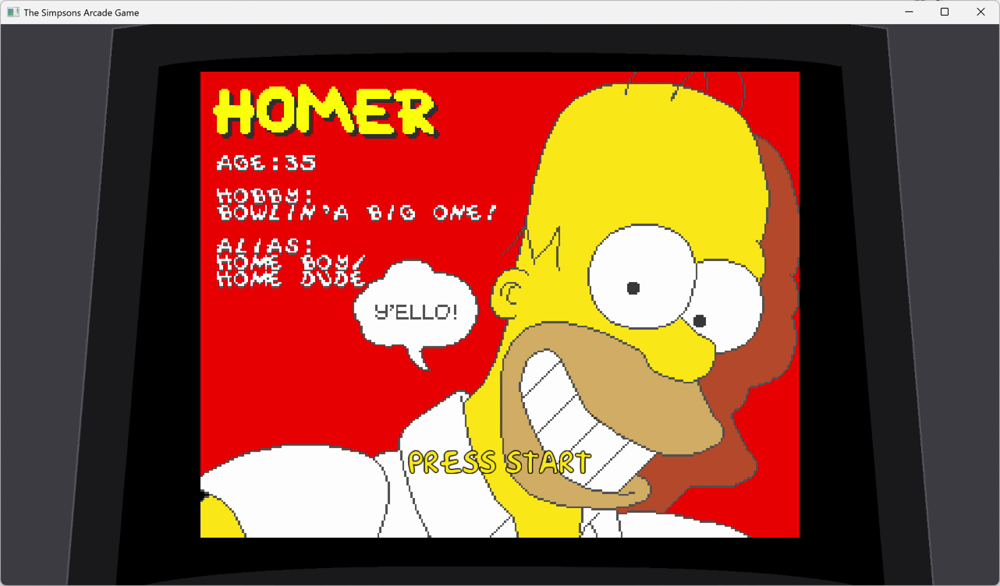

# 🍩 simpsonsarcade-ps3 — Static Recompilation

> *"Mmm... native code."* — Homer J. Simpson, probably

A static recompilation of **The Simpsons Arcade Game** (PlayStation 3 / PSN) into a native
PC executable — no emulator required — built on [ps3recomp](https://github.com/sp00nznet/ps3recomp).

This is the PS3 sibling of our **already-playable** Xbox 360 port,
[`simpsonsarcade`](https://github.com/sp00nznet/simpsonsarcade). Same game, same Konami arcade
core, same data files — just a different flavour of PowerPC underneath. The plan was to steal
everything we learned over there and point it at the Cell — and it worked: this build boots,
plays its intro, reaches the menus, and runs the arcade core natively.

> **Why this is easier than it sounds:** both the Xbox 360 (Xenon) and the PS3 (Cell PPE) run
> **64-bit big-endian PowerPC with VMX/AltiVec**. We already recompiled this exact game once.
> The PS3 EBOOT is *the same game logic* compiled by a different toolchain for a sister CPU.

---

## 🎥 It Runs



*Main menu → profile dialog → character select → Stage 1, captured frame-by-frame from the
native build (2026-09-26) — no emulator. No black flashes, no garbled glyphs.*

| | |
|---|---|
|  |  |
|  |  |

## 📺 The Game

| | |
|---|---|
| **Title** | The Simpsons Arcade Game |
| **Platform** | PlayStation 3 (PSN download) |
| **Title ID** | `NPUB30563` |
| **Content ID** | `UP0101-NPUB30563_00-SIMPSONSARCADEKO` |
| **Trophy ID** | `NPWR01444_00` |
| **Developer** | Backbone Entertainment / Konami |
| **Publisher** | Konami |
| **Original** | 1991 Konami 4-player arcade beat-'em-up |
| **Players** | Homer, Marge, Bart & Lisa (1–4 player co-op) |

Under the hood, the PSN/XBLA release is an **arcade-emulator wrapper**: the original 1991 coin-op
ROM lives inside the `SIMPSONS.SR` data archive (we can see the romset manifest —
`Simpsons_4J.KON`, `..._TILES/SPRITES/SOUND/SAMPLES.ROM`), and the EBOOT emulates the arcade
hardware around it — Konami 052001 (6809) + Z80 + `YM2151` + K053260, all named right in the
binary. Same architectural trick as the Genesis-on-XBLA ports like Comix Zone. **We recompile the
emulator; the game's 6809 code just gets interpreted from the ROM** — which is why the
already-working 360 build is such a strong oracle. See [`docs/emulator-architecture.md`](docs/emulator-architecture.md).

---

## 🎯 Status

**Playable.** The title boots, plays its intro, reaches the menus, saves and loads its
progress, and runs the arcade core at 35–60 fps with keyboard input.

| Milestone | Status |
|---|---|
| Locate & extract the PSN PKG | ✅ Done |
| Confirm it's the same game as the 360 build | ✅ Done — `SIMPSONS.SR` is **byte-identical** (2,748,416 B) |
| Decrypt EBOOT.BIN (SELF → ELF) | ✅ Done — `rpcs3 --decrypt` (no RAP needed) |
| Function discovery + PPU lift | ✅ Done — 3,813 detected → **5,019 lifted** |
| Build on the shared ps3recomp harness | ✅ Done — same shape as flOw / Twisted Metal |
| First boot (recompiled CRT runs) | ✅ Done |
| Reach `main()` / CRT init | ✅ Done |
| SPURS/CRI SPU jobs execute | ✅ Done — the two job binaries are lifted and registered |
| Graphics (RSX → D3D12) | ✅ Done — caner's live NV4097 engine, `RSX_LIVE_DRAW=1` |
| Intro videos → menus → attract | ✅ Done |
| Arcade core running | ✅ Done — Stage 1 Downtown Springfield plays |
| Input | ✅ Keyboard; XInput pad when one is attached |
| 🍩 Playable | ✅ **Yes** |
| Save / load | ✅ Settings & progress round-trip across boots |
| UI / glyphs | ✅ Fixed — no full-screen font atlas, no garbled text |
| Frame pacing | ✅ Fixed — no black/partial flash frames |
| Audio | ✅ Music (ATRAC3plus) plays; mixer paced to the device, no underruns |
| Frame rate | ⚠️ 60 in menus, 35–57 in gameplay |

### Verified against current ps3recomp master (2026-09-21)

"Playable" re-checked rather than carried forward, because two other ports in
this family turned out to be claiming status measured against broken setups.
Rebuilt against ps3recomp master and driven headlessly, with frames read back
from the swapchain (`LD_FRAME_DUMP`) rather than trusted from a log:

* arcade-cabinet frame -> Konami intro (the falling diamond) -> character select
  (Lisa) -> **Stage 1, Downtown Springfield, in play** -- health bar, 3 lives,
  a Burns henchman outside the Jewelers, CREDITS counter, PRESS START slots for
  players 2-4;
* two captures 240 flips apart show both characters in different positions, so
  it is live gameplay and not a held frame;
* 74,915 command packets, 63,310 draw groups executed, **zero** failed file
  opens.

**Driving it headlessly:** press START (`0x0008`) **once** to coin in, then use
**only CROSS** (`0x4000`). `PAD_AUTOPRESS` pulses START every few seconds, which
repeatedly opens the in-game pause menu -- that menu ("RESUME GAME" / "RETURN TO
THE GAME") is itself proof a game is running, but it hides the gameplay behind
it.

```bash
RSX_LIVE_DRAW=1 PAD_SCRIPT="15:0x0008,30:0x4000,50:0x4000,70:0x4000,..."   LD_FRAME_DUMP=shots LD_FRAME_DUMP_EVERY=60   ./build/simpsons vfs/PS3_GAME/USRDIR/EBOOT.elf
```

One new number worth chasing: **11,597 of 74,907 draw groups (~15%) were dropped
on `pso`** -- pipeline-state creation failing -- over a ten-minute run. The game
is playable regardless, but that is a sixth of the scene never reaching the GPU
and is a plausible contributor to the font-atlas artifact below.

### Fixed 2026-09-26: flashes, glyphs, saves

Built against the gh3 runtime lineage plus
[ps3recomp#185](https://github.com/sp00nznet/ps3recomp/pull/185). Measured by dumping
**every** presented frame and scanning for single-frame outliers:

| | before | after |
|---|---|---|
| single-frame flashes | 107 in ~2,600 frames | 0 in ~2,800 |
| presents of a surface cleared after its last draw | ~10% | 0.03% |
| draws dropped on `pso` | 17k–46k per run | **0** |
| second boot | "Settings and Progress data is corrupt" | loads |
| gameplay fps | 19–37 | 35–57 |

- **Flashes and glyphs were one bug.** Every frame the game runs a SPURS job chain
  that DMAs the fragment programs and vertices for draws it has *already queued*,
  then calls `cellSpursJoinJobChain` before submitting. Join was a no-op, so the
  RSX drain reached those draws first: a program that read as zeros dropped the
  draw (a black frame) and half-written vertices drew the font atlas full-screen.
  Join now waits for the chain. This was also the "15% dropped on `pso`" above.
- **Frames missing their last draws.** `_cellGcmSetFlipCommand` flipped at call
  time, ~2.4 KB of commands before the game flushed its frame's tail. The flip now
  goes into the FIFO at `ctx->current`, as the real library does.
- **Save reported corrupt every boot.** The load callback requires a SECUREFILE
  entry; the runtime reported every file as NORMALFILE. The file type now persists.

### Fixed 2026-09-27: audio stutter and missing music

With [ps3recomp#186](https://github.com/sp00nznet/ps3recomp/pull/186). Measured from
`AUDIO_STATS=1` and from `AUDIO_DUMP`, the exact samples handed to the device:

| | before | after |
|---|---|---|
| mixer blocks/s (device plays 187.5) | 131–232 | 187 |
| device underruns | up to 40/s | 0 over 130 s |
| samples dropped at submit | up to 11,500/s | 0 |
| menu music | never played (`cellAtrac` missing) | sample-exact vs. an offline decode |
| lost music blocks | ~1,300 gaps in 15 s (first cut) | ~4 per 50 s |

- **`cellAtrac` was unimplemented**, so the three ATRAC3plus tracks in
  `SIMPSONS_FW.SR` never played. It now decodes with FFmpeg's decoder (PPSSPP's
  `at3_standalone`, LGPL, vendored separately in the runtime).
- **The mixer ran at the wrong speed.** It paced itself with `Sleep(2)`/`Sleep(5)`,
  so it drifted between 170 and 230 blocks/s, truncating audio when it ran ahead and
  starving the device when it lagged. It now consumes one block per 5.33 ms.
- **The spacing matters to the game.** `dfMusic_PS3` polls the audio read index
  every 2.5 ms and refills exactly one block per change, so the index must advance
  one block at a time. An early fix that topped the device up in bursts played the
  music at half rate. The game's priority-0 audio threads also now run above normal
  host priority, and the mixer thread at time-critical.

### Known issues

- **In-stage sound thins out when the frame rate drops.** The arcade core seems to
  produce its sound per emulated frame. Below 60 fps its own sample stream has
  gaps, 7× denser than in the 60 fps menus. These aren't lost mixer blocks (none are
  block-aligned); it is the frame rate showing up in the audio.
- **"Not signed in to a gamer profile."** The title's PSN-offline notice (its NP
  init imports are unresolved). It does not block saving -- the save round-trips.
- **Frame rate.** 60 in menus, 35–57 in gameplay.

See [`PROGRESS.md`](PROGRESS.md) for the blow-by-blow.

---

## 🧬 How It Lines Up With the 360 Build

The whole reason this project exists: **we already did the hard part once.** Here's the overlap.

| | Xbox 360 (done, playable) | PlayStation 3 (this repo) |
|---|---|---|
| CPU | Xenon — 64-bit big-endian PowerPC + VMX128 | Cell PPE — 64-bit big-endian PowerPC + VMX/AltiVec |
| Executable | `default.xex` (XEX2, 1.33 MB) | `EBOOT.BIN` (SELF, 1.63 MB) |
| Code base | `.text` @ `0x820A0000`, size `0x237350` | `.text` @ `0x10000`, size `0x1628E8` |
| Entry point | `0x8214DB50` | `0x00186900` |
| Recompiler | XenonRecomp → C++ | ps3recomp `ppu_lifter` → C++ |
| Runtime | ReXGlue SDK (Xbox 360 HLE) | ps3recomp HLE libs (LV2/Cell HLE) |
| **Game data** | `0B/SIMPSONS.SR` (2,748,416 B) | `0B/SIMPSONS.SR` (**2,748,416 B — identical**) |
| **Assets** | `0B/SIMPSONS_FW.SR` (14.4 MB) | `0B/SIMPSONS_FW.SR` (15.8 MB) |

**What transfers directly:** the function-level structure of the arcade emulator core, the `.SR`
archive format and load path, the VMX/AltiVec usage patterns, the speed-fix lessons (timebase
scaling, frame limiting), and the menu/unlock logic we reverse-engineered on the 360.

**What's different:** the OS layer (Xbox kernel/XAM/XMA vs. LV2/Cell/cellGcm/cellAudio), the GPU
(Xenos vs. RSX), the executable container, and address layout. Those are exactly the gaps
ps3recomp already fills (see the `flOw` and `tokyojungle` ports).

Full analysis: [`docs/360-crossref.md`](docs/360-crossref.md) · PS3 binary notes:
[`docs/binary-analysis.md`](docs/binary-analysis.md).

---

## 🛠️ Pipeline

```
  PSN PKG ──► EBOOT.BIN ──► EBOOT.elf ──► ppu_lifter ──► C++ ──► link ps3recomp ──► simpsons.exe
              (SELF)        (decrypt)     (5,019 fns)           (shared harness + HLE)
                                              ▲
             SPURS job images ── spu_lifter ──┘   (captured at dispatch, not in the EBOOT)
```

Same five-stage flow as every ps3recomp port — extract, decrypt, analyse, lift, link. The
[`flOw`](https://github.com/sp00nznet/flow) port is the reference implementation of this pipeline.

## 📦 Building

Prereqs: Python 3.9+, CMake 3.20+, **clang-cl** + Ninja (the shared harness uses
`__builtin_bswap` and weak symbols MSVC lacks), and a sibling
[ps3recomp](https://github.com/sp00nznet/ps3recomp) checkout.

```bash
# 1. Decrypt your own legally-dumped EBOOT.BIN -> game/EBOOT.elf, and lay the
#    game data out the way the harness expects:
#       vfs/PS3_GAME/PARAM.SFO
#       vfs/PS3_GAME/USRDIR/EBOOT.elf
#       vfs/PS3_GAME/USRDIR/0B/SIMPSONS.SR, SIMPSONS_FW.SR

# 2. Lift the PPU image and generate the HLE NID table:
PS3RECOMP=../ps3recomp ./tools/relift.sh

# 3. Capture and lift the SPU job binaries. They are raw images the game builds
#    in main memory, not ELFs in the EBOOT, so they only exist at the moment
#    cellSpurs hands them over:
SPU_DUMP_MISS=spu_dump ./build/simpsons vfs/PS3_GAME/USRDIR/EBOOT.elf
PS3RECOMP=../ps3recomp ./tools/relift.sh     # now lifts them too

# 4. Build. Release is the default and it matters -- an unoptimised build of the
#    25 MB recompiled translation unit runs at a third the speed.
cmake -S . -B build -G Ninja -DCMAKE_C_COMPILER=clang-cl -DCMAKE_CXX_COMPILER=clang-cl
cmake --build build

# 5. Run, with the live NV4097 -> D3D12 draw engine:
RSX_LIVE_DRAW=1 ./build/simpsons vfs/PS3_GAME/USRDIR/EBOOT.elf
```

**Controls (keyboard).** Arrows move · `Z` attack · `X` jump · `A`/`S`
square/triangle · `Q`/`W` L1/R1 · `Enter` START · `Tab` SELECT. An XInput pad
takes over automatically when one is plugged in.

## ⚖️ Legal

This repository contains **no copyrighted game code, assets, binaries, or encryption keys** —
only analysis notes, configuration, and recompilation tooling. You must supply your own legally
obtained copy of The Simpsons Arcade Game. `pkg/`, `extracted/`, and `game/` are git-ignored.

## 🔗 Related Projects

- [ps3recomp](https://github.com/sp00nznet/ps3recomp) — the PS3 HLE runtime this links against
- [simpsonsarcade](https://github.com/sp00nznet/simpsonsarcade) — **the 360 port of this same game (playable)**
- [flOw](https://github.com/sp00nznet/flow) · [tokyojungle](https://github.com/sp00nznet/tokyojungle) — sister PS3 ports
- [N64Recomp](https://github.com/N64Recomp/N64Recomp) · [UnleashedRecomp](https://github.com/hedge-dev/UnleashedRecomp) — prior art
- [RPCS3](https://github.com/RPCS3/rpcs3) — emulator whose HLE research makes this possible

---

*"I'm not normally a praying man, but if you're up there, please save me, Superman."* — port it natively instead.
